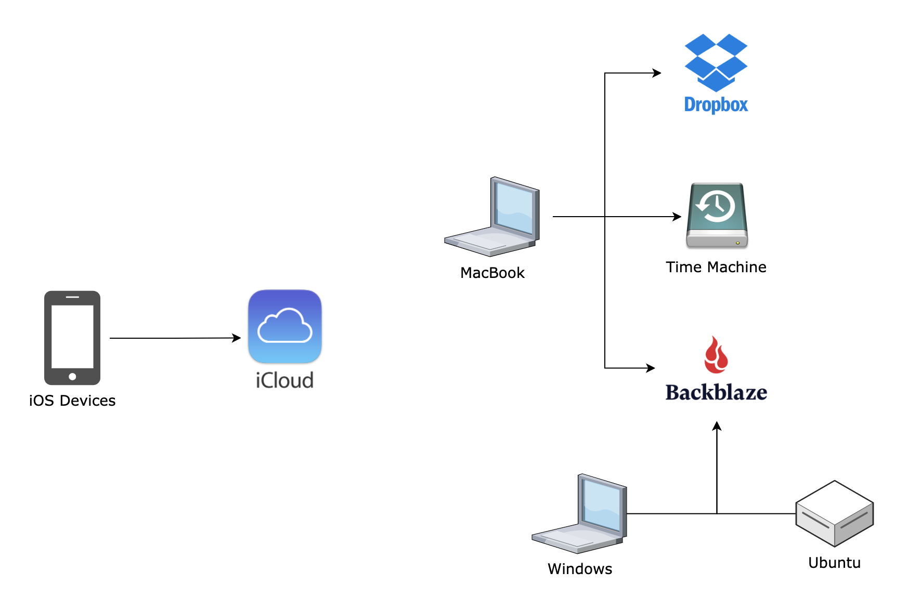
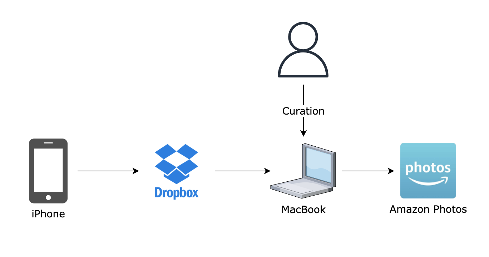

## Backups and Photo Management

I have spent entirely too much time over the years thinking about and tinkering with systems for backing up our data and managing our photos. This post documents the current state of things.

### Backups

Unsurprisingly, our iPhones and iPads back up to iCloud. We have 200 GB of shared storage for the family as part of our [Apple One](https://www.apple.com/ca/apple-one/) subscription, which is more than enough.

Our primary MacBook has a couple layers of backup. Most of our files are continuously synced to [Dropbox](https://dropbox.com). We somehow have a free account with 25 GB of storage...I'm pretty sure this is the result of a Google Ads campaign I ran with my referral link back in 2010. 🤫

The MacBook is also backed up to our home server a few times per day via Time Machine, as well as to an external drive that I remember to connect maybe one per month.

Both the MacBook and my son's Windows laptop also back up continuously to [Backblaze](https://www.backblaze.com/mac-online-backup.html), which costs $70 USD per year for each machine. 

Finally, I use [`restic`](https://restic.net/) to backup the data and container configurations from our home server to Backblaze's [B2 cloud storage](https://www.backblaze.com/b2/cloud-storage.html) service, which costs ~$2 / month.

### Photo Management

Probably our most important digital assets are our photos and videos, so it's especially important to have them automatically backed up. This is mainly handled by the processes above as the photos are really just more data. But we also want our photos to be accessible, while at the same time not preserving every random screenshot or terrible selfie for prosperity. It took a long time to settle on our current system, but it's been stable for a while now and I'm quite happy with it.

Before we go further, let's take a moment to remember Everpix, the original photo management solution that was way ahead of its time. The Verge wrote a great [post-mortem](https://www.theverge.com/2013/11/5/5039216/everpix-life-and-death-inside-the-worlds-best-photo-startup) about them in 2013 that is worth a read.

Okay, on to our system. We don't own any cameras other than our iPhones, and we use Dropbox to upload everything we capture with them to cloud storage. This upload is supposed to be triggered automatically when the phones switch networks (like when they join our home wifi), but in practice I find that we need to periodically open the Dropbox app to make sure everything has synced.

The Dropbox app on our MacBook then downloads the photos and videos, where they're backed up using the processes above. This is also where the curation magic happens. Every few months I go through the raw uploads in Dropbox and choose which photos and videos are worth keeping and delete the rest.

I move the keepers over to a long-term photos folder, where they are picked up by [Amazon Photos](https://www.amazon.ca/b?ie=UTF8&node=16055944011) and pushed up into the Amazon cloud. Our Amazon Prime subscription gives us unlimited photo storage, and we pay $25/year to add 100 GB of video storage to the included 5 GB. We're currently only using 27.2 GB, so this should hopefully last us for a while.

Amazon Photos is the primary interface through which we interact with our photos, including searching for different occasions, people, or places. We have the iOS app on our phones, and they've done a good job of implementing the "on this day" feature that Everpix pioneered to resurface our old photos and videos on a daily basis. This is often one of first things that my wife and I look at most mornings, and it often sparks joy with some random moment from when the kids were small.

A couple notes on what we're not using:

- We don't use Apple's native photo management system, mainly because it's opaque and proprietary. I definitely prefer having photos in a normal file system that I can organize.
- We're not using Amazon Photos's automatic upload feature to push from our phones straight into the cloud, because we don't want to automatically keep absolutely everything. I also like to have a copy on the MacBook to pull them into the backups.
- We previously used Google Photos, and its search was pretty incredible. However, Amazon Photos was clearly the better option for us once Google updated their pricing.
