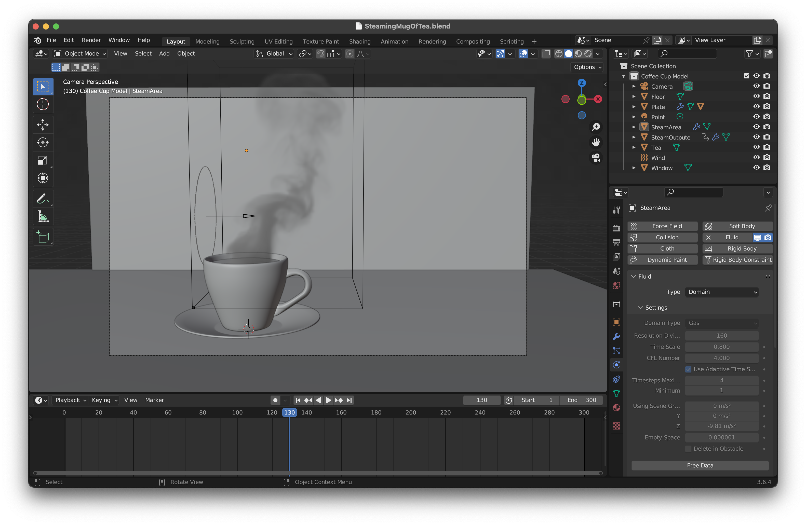
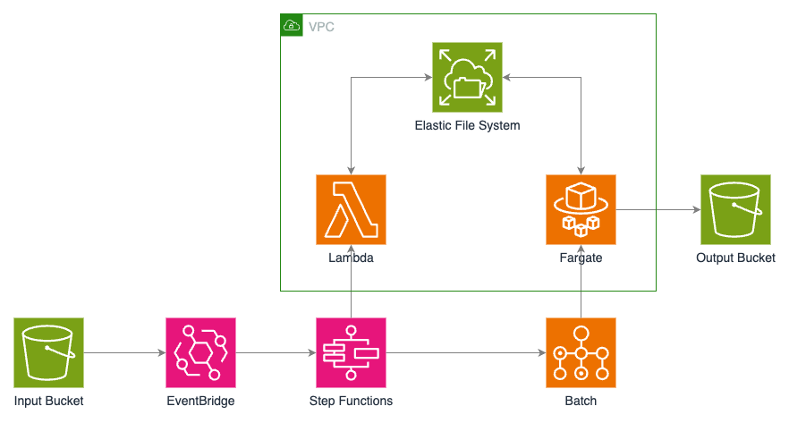

My son has gotten interested in 3D animation with [Blender](https://www.blender.org/), but his low-grade laptop is too underpowered to render any reasonably complex animation in a sane amount of time. He finally agreed to try out rendering in the cloud, and this post describes what I ended up building.

I came across a promising [workshop](https://ec2spotworkshops.com/rendering-with-batch.html) from AWS that used [AWS Batch](https://aws.amazon.com/batch/) to split a rendering job across multiple compute nodes. This seemed to be exactly what we needed (really, they had me at [Step Functions](https://aws.amazon.com/step-functions/)) so I worked through the workshop steps and got the solution up and running fairly easily.

After testing out the existing code, I decided to make a few improvements:

- Rebuild the project using AWS's [Cloud Development Kit (CDK)](https://aws.amazon.com/cdk/)
- Use [Fargate](https://aws.amazon.com/fargate/)'s serverless container hosting instead of [Elastic Compute Cloud (EC2)](https://aws.amazon.com/ec2/) servers
- Use an existing Docker [image](https://docs.linuxserver.io/images/docker-blender) with the latest version of Blender pre-installed
- Leverage [Elastic File System (EFS)](https://aws.amazon.com/efs/) to share files among [Lambda](https://aws.amazon.com/lambda/) functions and Fargate containers
- Add support for `.zip` files to allow the pipeline to render fluid simulations (like the steam above), which can't be packed into a single `.blend` project file

Below is a high-level view of the new project:

The basic flow of the pipeline is as follows:

1. A `.blend` or `.zip` file is uploaded to the input bucket in [Simple Storage Service (S3)](https://aws.amazon.com/s3/).
1. An [EventBridge](https://aws.amazon.com/eventbridge/) rule triggers a state machine in Step Functions, which executes the following steps:
   1. A Lambda function extracts the `.zip` file (if required) and writes the project file(s) to EFS.
   1. A Lambda function analyzes the `.blend` file and determines how many frames need to be rendered.
   1. A Batch job is created and executes container-based tasks in Fargate, each of which renders a single frame and writes it to EFS.
   1. A single-task Batch job is created to stich the frames together into a movie file, which is uploaded to the output bucket in S3.

And here's the rendered output in GIF form:

The code for this project is availabe on [Github](https://github.com/michaeldavie/rendering-pipeline).
