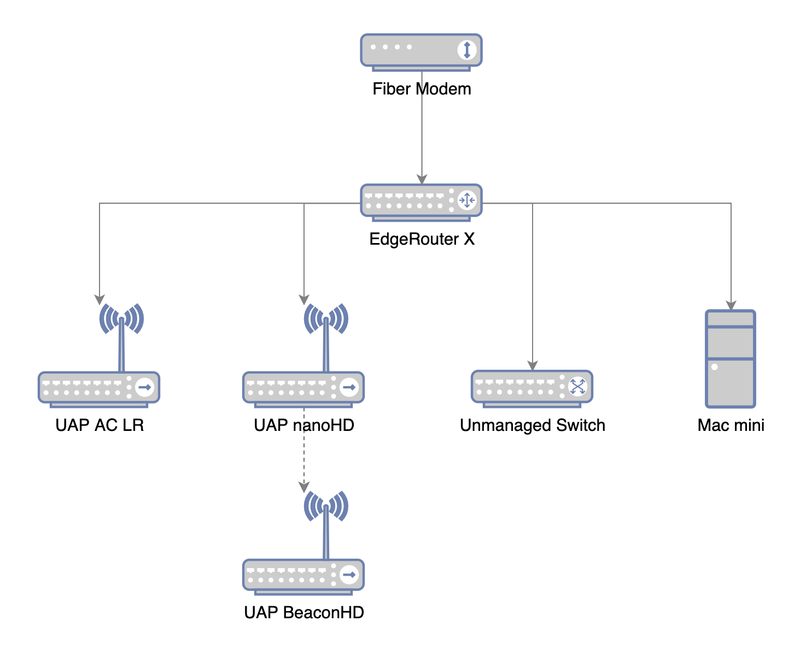
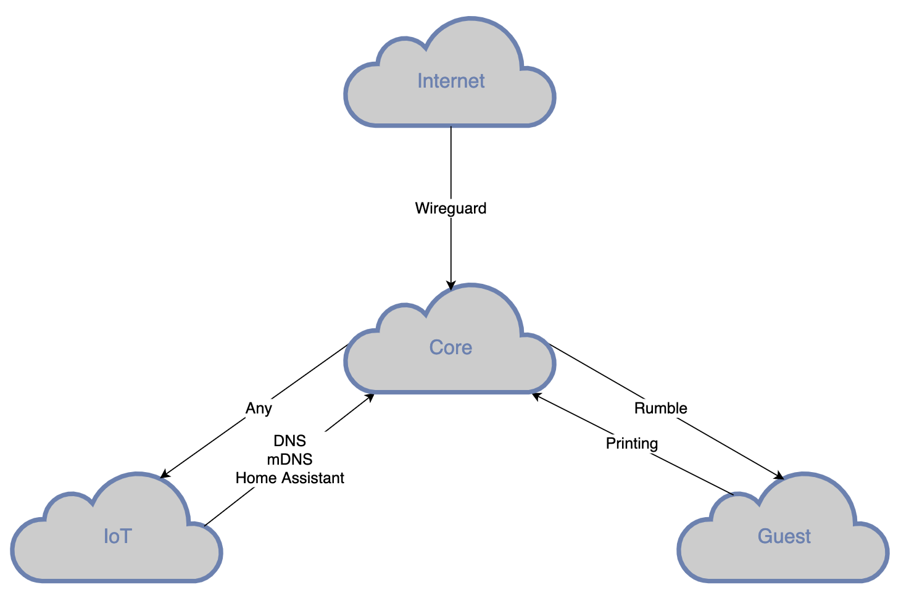

## Our Overly Complex Home LAN

Over the years, our home network has grown increasingly complex. It's fairly stable at this point, and I think reasonably secure as well. Here's a breakdown.

### Physical

The edge of our network is the combined fiber modem / wireless router provided by our ISP. We basically use it as a modem, and put our real router in its DMZ.

The core of the network is a Ubiquiti [EdgeRouter X](https://store.ui.com/collections/operator-edgemax-routers/products/edgerouter-x). It's an inexpensive but full-featured 5-port gigabit router, and might be the best device out there for this kind of "prosumer" use case. The five ports are connected as follows:

- WAN uplink to modem
- 2 x Ubiquiti [UniFi](https://store.ui.com/collections/unifi-network-wireless) wireless access points (an AC Long-range and a nanoHD)
- Unmanaged 8-port switch, for wired IoT devices
- Mac mini server

There's also a Ubiquiti [BeaconHD](https://store.ui.com/collections/unifi-network-wireless/products/uap-beaconhd) access point that is connected to the nanoHD via a wireless mesh link.

This setup has been great throughout the past couple years of pandemic-induced remote work and home school, including multiple simultaneous video calls. We typically have around 30 client devices connected to the wifi, and when we downgraded our WAN link to the slowest / cheapest plan available (125 Mbps down / 10 Mbps up), there was no perceptible change in performance.

### Logical

Our network is logically divided into three zones, with a separate VLAN tag and wireless SSID for each:

- Core - This is where our main devices reside, including our laptops, tablets, and phones. The server and printer also reside in this zone, along with the Sonos speakers because they're just weird.
- IoT - We have entirely too many smart devices on our network, and they're difficult to put much faith in security-wise. They live in their own zone to keep them away from everything else.
- Guest - The guest zone is primarily used for our employer-managed devices, as well as the occasional actual guest.

### Network Security

Each zone has largely unrestricted access to the internet, except for the core and IoT zones which have a degree of content filtering. This is provided by a local [AdGuard Home](https://github.com/AdguardTeam/AdGuardHome) DNS server, which blocks domains associated with advertising, tracking, and adult content.

Network flows between the zones are controlled via the EdgeRouter and are explicitly authorized. As shown in the diagram above, the following connections are the only ones allowed beyond internet access:

- [Wireguard](https://wireguard.com) VPN connections from the internet, which are forwarded to a container on the Mac mini server.
- Any connections from the core zone to the IoT zone.
- Connections from the IoT zone to the core zone for DNS, multicast DNS (mDNS), and to the [Home Assistant](https://www.home-assistant.io/) container.
- Connections from the [Rumble](https://rumble.run) network scanner in the core zone to the guest zone.
- Connections from the guest zone to the printer in the core zone.

### Networking Services

I run a few networking-related services in containers on the Mac mini server:

- AdGuard Home ([image](https://hub.docker.com/r/adguard/adguardhome))
- UniFi wireless network controller ([image](https://hub.docker.com/r/jacobalberty/unifi))
- Cloudflare dynamic DNS updater ([image](https://hub.docker.com/r/joshava/cloudflare-ddns/))
- Wireguard VPN server ([image](https://hub.docker.com/r/linuxserver/wireguard))
- Rumble network scanner ([config](https://www.rumble.run/docs/installing-an-explorer/#container-installations))
