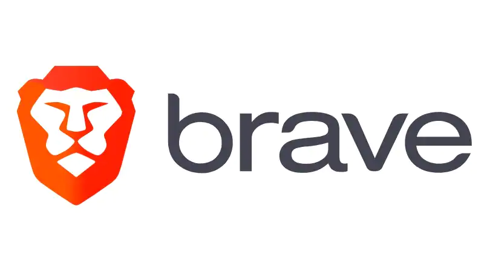
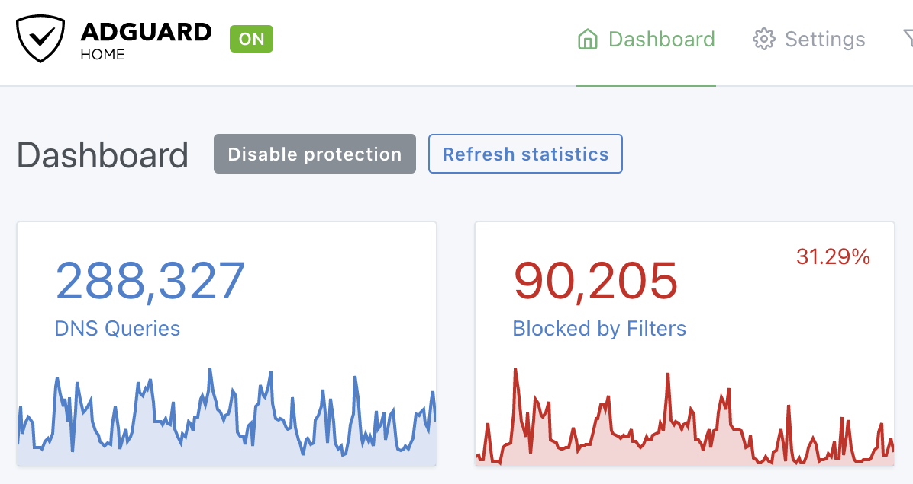

## Privacy Technologies

A few years ago I read Tim Wu's excellent book, [The Attention Merchants](https://www.goodreads.com/book/show/28503628-the-attention-merchants), which opened my eyes to the pervasiveness of what's become known as surveillance capitalism. (The documentary [The Social Dilemma](https://www.youtube.com/watch?v=uaaC57tcci0) also did a great job of highlighting this problem.) Afterward, I basically declared war on advertising in our family's lives, and deployed a number of technologies on our devices and our home LAN to block as much of it as possible. Here's our setup:

### Brave Browser

We use [Brave](https://brave.com/) as the primary browser on all of our devices. It blocks ads and trackers directly in the browser, and generally just works out of the box as a drop-in replacement for Chrome.

### AdGuard Home

I run [AdGuard Home](https://github.com/AdguardTeam/AdguardHome) in a container as the local DNS server for our LAN. It blocks ads and trackers at the DNS level, and configuring it with just four blocklists causes 25-30% of our network's DNS queries to be blocked, _without breaking anything_. As a bonus it also blocks adult content.

### Canadian Shield / Quad9

We use both CIRA's [Canadian Shield](https://www.cira.ca/cybersecurity-services/canadian-shield) and [Quad9](https://quad9.net/) as upstream DNS providers. Both provide protection against known malicious domains, while supporting encrypted DNS-over-TLS to keep our DNS queries private from our ISP.

I also wrote a custom configuration for our iOS devices so that they use Canadian Shield via DNS-over-TLS whenever they're not connected to our home wifi. I've published a copy as a [gist](https://gist.github.com/michaeldavie/d78e3fa6268c88c4ead093f757016309); just plug in your local SSID and [install the config](https://support.apple.com/en-ca/HT209435) on your devices if you'd like to do the same.

If you're a more normal person who doesn't run a local DNS server at home, Paul Miller has also [published](https://github.com/paulmillr/encrypted-dns) profiles that will enforce encrypted DNS on your iOS and macOS devices, including for Canadian Shield (contributed by me!).

### Wireguard

When I'm traveling and need to connect to some dodgy wifi (which is admittedly not too often lately), I use [Wireguard](https://www.wireguard.com/) to make a VPN connection back to our home LAN. I've got profiles deployed on our phones and laptops, and it also just works. It also provided a handy workaround when my son was having trouble getting Stardew Valley's multiplayer mode to work with his cousin. Virual LAN party FTW!